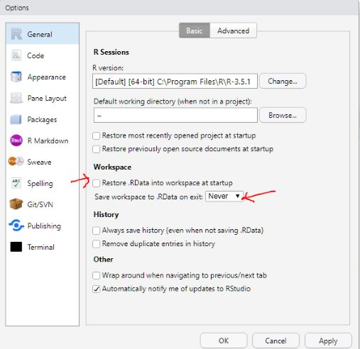

```{r setup, include=FALSE}
options(htmltools.dir.version = FALSE)
knitr::opts_chunk$set(tidy = FALSE, 
                      eval = FALSE, tidy.opts=list(width.cutoff=40))
```

# This talk is `not` for those who...

- haven't used RStudio

--

- haven't used R for three months or worked on more than `3` projects

--

- expect to see a systematic review like a book or a workshop

---
# This talk is actually ...

--

- from my daily regimen of programming in R

--

- about **good** practices from my own view, aka, `biased` 

--

- my experiences of gradually adopting new programming habits

---
# Who am I and what do I use R for?

--

- A Ph.D. student in biostatistics from USC 

--

- I use R for > 5hrs/per day and my dissertation is dependent on R

--

- I self-taught R in 2013 from a reproducible project in R

--

- I've done R Markdown, R packages, Shiny apps, high-performance computing, data visualization, Bayesian statistics, machine learning, version control with Git and etc in R. 

--

- Some other non-academic projects with R: ranking movies by ratings from my MoviePass membership, web scraping my favoriate brand of clothes, ...  

--

- `NEW YEAR RESOLUTION`: an intermediate user who would like to become an advanced learner in 2019 🤓

---
## I know running things in RStudio, now what?

--
#### Start a new analysis 

- Open RStudio and create a new R script
- Too many R scripts in a folder

--

`-> RStudio project`

--
#### Retrieve an old analysis

- What is the name of that file again? test.R, test2.R, final.R, or project.R? 

--

`-> Naming files`

--
#### Run an analysis in RStudio 
- Click run bottom for a thousand times
- Use `=` instead of ` <- ` without any indentation or surrounding spaces
- overwelmed by seeing too much code

--

`-> Customize RStudio`, `Code style`

---


class: inverse, center, middle

# Get Started

---

# Download RStudio
https://www.rstudio.com/products/rstudio/download/


---
# Customize panes


---
# Customize panes


---
# Don't go by default

---
# Don't go by default


---
# Always start with a project


---
# Always start with a project


---
# Use relative paths

###NO!
```{r eval=FALSE, tidy=FALSE}
pathName <- "/Users/Zhi/Dropbox/PRL_GoodPractice/files/dataset-2019-01.csv"
```

--
###YES!
```{r eval=FALSE, tidy=FALSE}
pathName <- "data/dataset-2019-01.csv"
```

---
# Google's R style guide
What [Google](https://google.github.io/styleguide/Rguide.xml) suggests about the style of programming in R


---
# Name files 
Recommended by @Emil_Hvitfeldt

###NO!
```{r eval=FALSE, tidy=FALSE}
- test.R, test2.R
- final.pdf
- project.rmd
- analysis20180501.r 
```

--
###YES!
```{r eval=FALSE, tidy=FALSE}
- 2019-01-09_pm511a_finalproject.r
- 01_pm511a_finalproject.r
- analysis_pm511a_finalproject.r
```


---
# Name identifiers
###NO! 
```{r eval=FALSE, tidy=FALSE}
- "Variables": avg_Clicks, 
- "Functions": calculate_avg_clicks, calculateAvgClicks
```

--
Don't use underscores ( _ ) or hyphens ( - ) in identifiers

--
###YES!
```{r eval=FALSE, tidy=FALSE}
- "Variables": avgClicks, avg.clicks
- "Functions": CalculateAvgClicks
```

--
Generally, variable names should be nouns and function names should be verbs.

---
# Format codes (be nice to yourself 👁👁)

--
```{r, eval = FALSE}
genRandom=function(n){rnorm(n,10,10)}
plot(2^seq(2,10,0.5),sapply(sapply(2^seq(2,10,0.5),genRandom),mean))
```

--
- Do use ` <- ` instead of `=`
- Do pipe `%>%` instead of `((()))`
- Do use spaces
- Do wrap long lines
- Do indent lines with two spaces

--

Instead, we can write codes like
```{r}
libary(magrittr)
xVar <- 2^seq(2,10,0.5)
genRandom <- function(n) {
  rnorm(n, mean = 10, sd = 10)
}

sapply(xVar, genRandom) %>%
  sapply(mean) %>%
  plot(xVar, .)

```

---
# Still not interested?
The `formatR` package, by Yihui Xie, makes it easier to clean up poorly formatted code. It can’t do everything, but it can quickly get your code from terrible to pretty good. -- Hadley Wickham  

```{r}
library(formatR)
genRandom=function(n){rnorm(n,10,10)}
```

--
Copy the above code to clipboard and type `tidy_source(width.cutoff = 50)`

```{r}
genRandom = function(n) {
    rnorm(n, 10, 10)
}
```

---
# Comment your codes
```{r, eval=FALSE}
libary(magrittr)
*# explore the number of simulations in a wide rang-------------------------
xVar <- 2^seq(2,10,0.5)

*# write a function to simulate n numbers of standard normally distribution R.V.s
genRandom <- function(n) {
  rnorm(n)
}

*# create a plot with mean against a range of number of simulations
sapply(xVar, genRandom) %>%
  sapply(mean) %>%
  plot(xVar, .)

```
Have all the library calls and hard-coded variables on the topic of the script

--
### Be nice to your future self three months from now 🤗

---
# Write loops and functions 
`apply`, `sapply`, `lapply`, `replicate` help to declutter codes 

###NO! 
```{r eval=FALSE, tidy=FALSE}
rnorm(10, mean = 0, sd = 1)
rnorm(1e2, mean = 0, sd = 1)
rnorm(1e3, mean = 0, sd = 1)
rnorm(1e4, mean = 0, sd = 1)
```


--
###YES!
```{r eval=FALSE, tidy=FALSE}
n <- 10^(1:4)
n %>% 
  sapply(function(x) rnorm(x, mean = 0, sd = 1))
```


Have a file with functions in it and source it after loading libraries

---
# Organize files

```{r}
Project
├── code
├── data
├── fig
├── result
```

input and output 
```{r}
read.csv(data/dataset.csv)
ggsave("fig/mtcars.png")
```

---
# Create shortcuts
- `Ctrl+X/C/V/Z/Y/S ->` Cut/Copy/Paste/Undo/Redo/Save

--

- `Ctrl+Enter ->`  Run the current code

--

- `Ctrl+Shift+K ->` Knit Markdown

--

- `Alt + - ->` <-

--

- `Ctrl+Shift+M ->` %>%

--

- `Ctrl+Shift+F10 ->` Restart R

---
# Have troubles?
- https://stackoverflow.com/

- https://support.rstudio.com

- https://twitter.com/  `#rstat#`

---
# Ask questions reproducibly 


---
class: center, middle

# More resources

Beyond Basic R:
https://owi.usgs.gov/blog/intro-best-practices/


Emil Hvitfeldt's talk : https://github.com/EmilHvitfeldt/oRganized-talk


---
class: center, middle

# Thanks! and Keep in touch
<br>

### @zhiiiyang
### zyang895@gmail.com
### 


Slides created via the R package [**xaringan**](https://github.com/yihui/xaringan)

Template created by [Alison Hill](https://twitter.com/apreshill)


